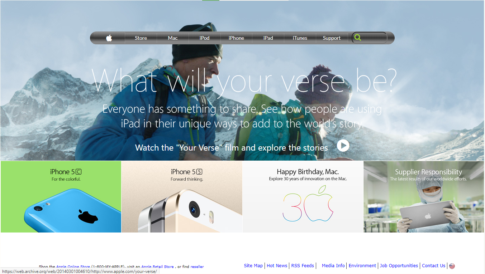

# Building with Backgrounds and Gradients
This is part of a series of projects to be completed by [Microverse](microverse.org) developer's program.

# Screenshot of the page

# Source Page:
This assignment consists of making [this](https://www.nytimes.com/2014/03/18/science/space/detection-of-waves-in-space-buttresses-landmark-theory-of-big-bang.html?_r=0)

# Live Version:
The demo page can be found [here](https://raw.githack.com/dasileker/new-york-times/new-york/index.html)

# Built With
- HTML 
- CSS  

# GitHub
@dasileker

@TSHEPO-CLOUD

# Facebook
@Tshepomolefe

@dasileker

