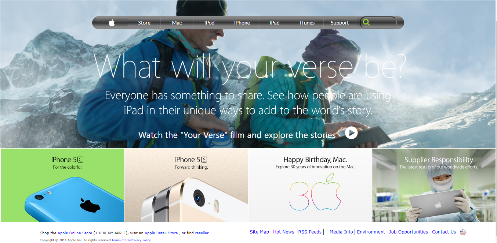

# Building with Backgrounds and Gradients
This is part of a series of projects to be completed by [Microverse](microverse.org) developer's program.

# Screenshot of the page

# Source Page:
This assignment consists of making [this](https://web.archive.org/web/20140301004610/http://www.apple.com/)

# Live Version:
The demo page can be found [here](https://rawcdn.githack.com/TSHEPO-CLOUD/Apple-project/c2a3802ac9690c4108cdfcbdb81e0842b8d295cf/index.html)

# Built With
- HTML 
- CSS  

# GitHub
@dasileker

@TSHEPO-CLOUD

# Facebook
@Tshepomolefe

@dasileker

